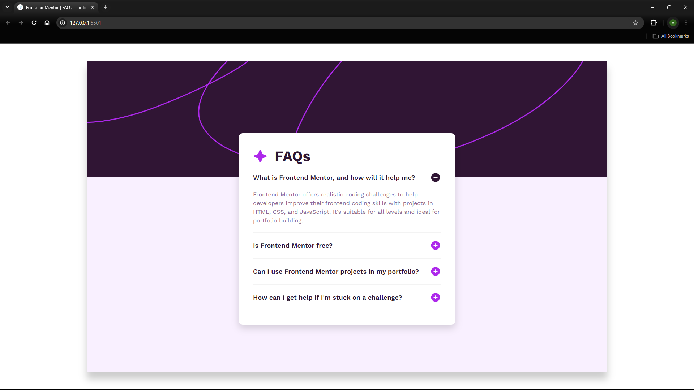

# Frontend Mentor - FAQ accordion solution

This is a solution to the [FAQ accordion challenge on Frontend Mentor](https://www.frontendmentor.io/challenges/faq-accordion-wyfFdeBwBz). Frontend Mentor challenges help you improve your coding skills by building realistic projects.

## Table of contents

- [Overview](#overview)
  - [The challenge](#the-challenge)
  - [Screenshot](#screenshot)
  - [Links](#links)
- [My process](#my-process)
  - [Built with](#built-with)
  - [Useful resources](#useful-resources)
- [Author](#author)
- [Acknowledgments](#acknowledgments)

## Overview

### The challenge

Users should be able to:

- Hide/Show the answer to a question when the question is clicked
- Navigate the questions and hide/show answers using keyboard navigation alone
- View the optimal layout for the interface depending on their device's screen size
- See hover and focus states for all interactive elements on the page

### Screenshot

### Links

- Live Site URL: [https://sully-faq-accordion.netlify.app/](https://sully-faq-accordion.netlify.app/)

## My process

### Built with

- Semantic HTML5 markup
- CSS custom properties
- Flexbox
- Desktop-first workflow
- Vanilla JavaScript

### Useful resources

- [JavaScript](https://www.udemy.com/course/the-complete-javascript-course/) - One of the best Javascript course out there.
- [HTML and CSS](https://www.udemy.com/course/design-and-develop-a-killer-website-with-html5-and-css3/) - HTML and CSS course.

## Author

- Frontend Mentor - [@Abu-Sman](https://www.frontendmentor.io/profile/Abu-Sman)
- Twitter - [@Abu_Sman01](https://www.twitter.com/Abu_Sman01)

## Acknowledgments

Big shoutout to Jonas Schmedtmann for being an amazing tutor! You're the best out there!
